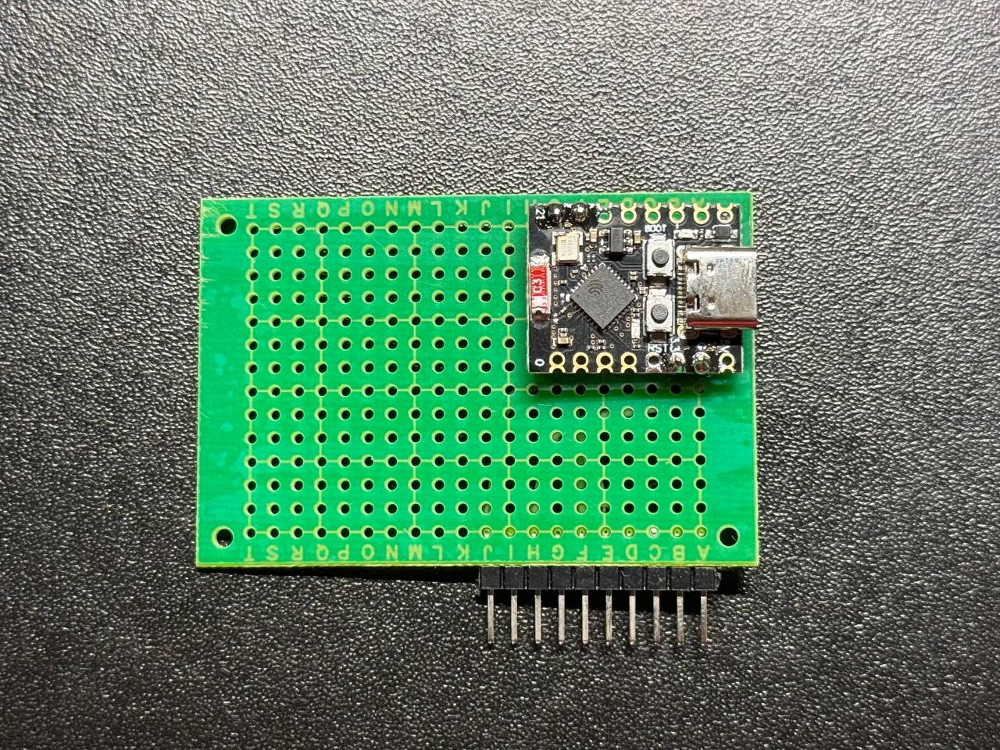
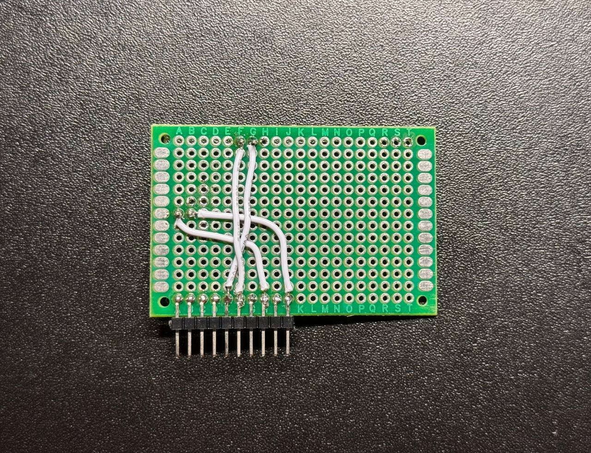
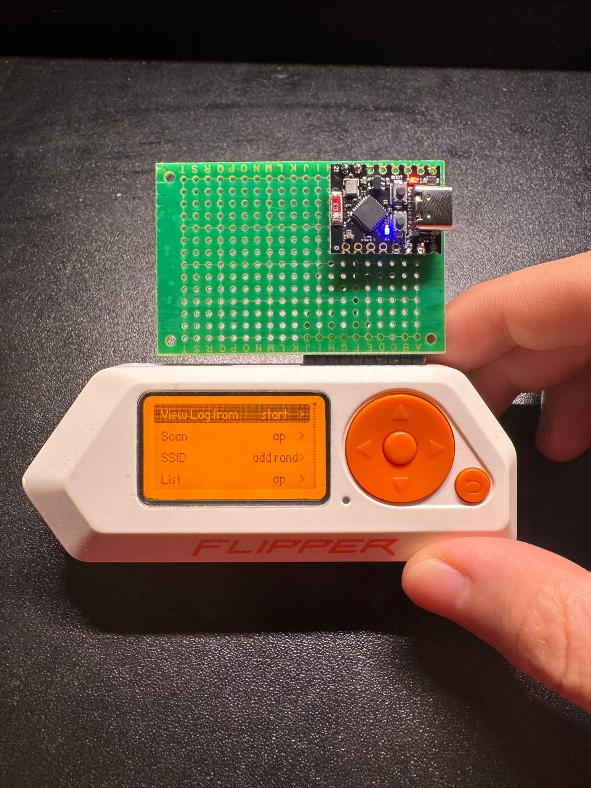

# DIY ESP32 DevBoard for Your Flipper Zero

Still think the official ESP32 WiFi development board is too pricey? Want to build your own and learn something cool along the way? You're in the right place! This repository will guide you through creating your very own ESP32 WiFi development board for the Flipper Zero at a fraction of the cost. This step-by-step guide is beginner-friendly and should take about an hour to complete. Let's get started!

# ⚠️ Important Disclaimer ⚠️

Before proceeding, please read and agree to the following declaration:  
**This project is intended solely for educational purposes. Do not use the ESP32 development board for any illegal activities. Any misuse of this project is solely your responsibility. The author and this repository disclaim all liability for any actions taken outside the scope of lawful and educational use.**

## Materials Required

1. **ESP32 Development Board**  
    Choose one of the following based on your preference:  
    - ESP32-S2  
    - ESP-WROOM-32  
    - ESP32-C3
    - ESP8266
2. **PCB Circuit Board**  
3. **Connecting Cables**  
4. **Pin Header**

## Tools You May Need

- **Soldering Iron**  
- **Tweezers**  
- **Multimeter**
- **Rosin Core Solder Wire**

## Wire Connections Between Flipper Zero & ESP32 WiFi Board

| Flipper Zero Pin | ESP32 WiFi Board Pin |
|------------------|----------------------|
| 3V3              | 3V3                  |
| GND              | GND                  |
| RX               | TX                   |
| TX               | RX                   |

## Step-by-Step Guide

Follow these steps to connect the ESP32 pins to your Flipper Zero:

1. **Prepare Your Workspace**  
    - Ensure your workspace is clean and well-lit.  
    - Gather all the required materials and tools listed above.  

2. **Inspect the ESP32 Board**  
    - Identify the pins on your ESP32 board (3V3, GND, TX, RX).  
    - Refer to the ESP32 datasheet if you're unsure about the pin layout.  

3. **Prepare the Connecting Cables**  
    - Cut the connecting cables to the desired length.  
    - Strip the ends of the cables to expose the wires.  

4. **Solder the Pin Headers (if needed)**  
    - If your ESP32 board does not have pre-soldered pin headers, solder them onto the board using a soldering iron and rosin core solder wire.  

5. **Connect the Wires and Test Connections**  
    - Use the table below as a reference to connect the Flipper Zero pins to the ESP32 pins.  
    - Ensure the connections are secure and there are no loose wires.  
    - Use a multimeter to test the continuity of each connection:  
        - Set the multimeter to continuity mode.  
        - Place one probe on the Flipper Zero pin and the other on the corresponding ESP32 pin.  
        - Verify that the multimeter beeps or shows continuity for each connection.  
        - If there is no continuity, check and secure the connection before proceeding. 
   
6. **Test the Setup**  
    - Plug your Flipper Zero and ESP32 board.  
    - Confirm that the ESP32 board is functioning as expected (Check the LED light on).  
    - Note: To fully utilize the ESP32 WiFi board, you will need to flash the [ESP32 WiFi Marauder firmware](https://github.com/justcallmekoko/ESP32Marauder) onto your ESP32 board.  
    - Additionally, ensure that your Flipper Zero is running unofficial firmware that supports advanced WiFi tools.  

## Visual Guide: ESP32-C3 Project Photos

### 1. Fully Assembled DevBoard

### 2. Wire Connections

### 3. Final Setup with Flipper Zero

## References

- [ESP32 Official Documentation](https://docs.espressif.com/projects/esp-idf/en/latest/esp32/index.html)  
- [Flipper Zero Official Website](https://flipperzero.one/)  
- [Soldering Basics for Beginners](https://learn.adafruit.com/adafruit-guide-excellent-soldering)  